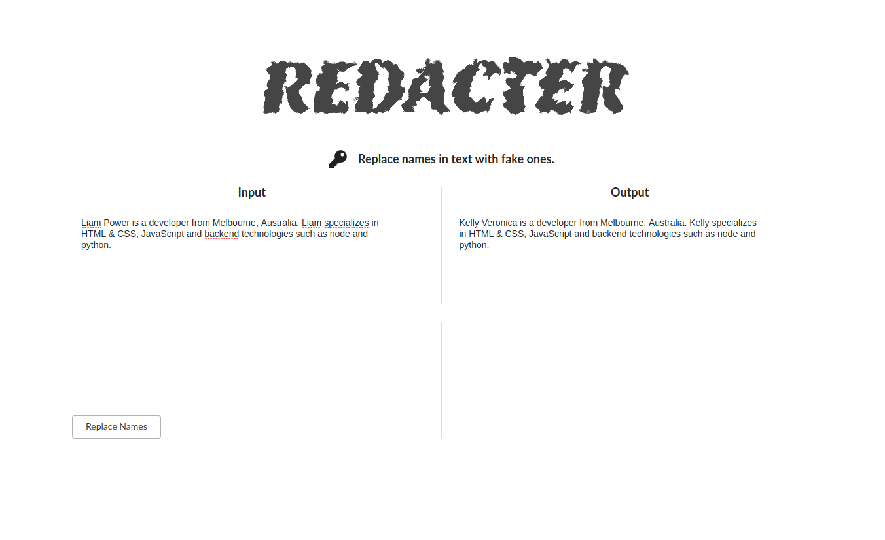

# Redacter

Redacter is a react app to replace real names in input text with fake ones.

It uses Stanfords NER tagger for tagging and the Faker library for generating fake names on a Flask backend.

